# 3D Carousel – Fusion 360 Project

[](https://www.autodesk.com/products/fusion-360)
[](https://www.prusa3d.com/)

A mechanically actuated 3D-printable amusement park carousel modeled in **Autodesk Fusion 360**. The project combines decorative design with functional mechanical transmission: a hand crank drives the rotation of the carousel platform, while a cam-based mechanism makes the horses move vertically, creating the classic up-and-down carousel motion.

> **Demo video:** [here](https://www.youtube.com/)

---

## Table of Contents

- [Project Overview](#project-overview)
- [Demo](#demo)
- [Gallery](#gallery)
- [Mechanical Architecture & Motion Flow](#mechanical-architecture--motion-flow)
- [Motion Link and Contact-Based Movement](#motion-link-and-contact-based-movement)
- [Main Components](#main-components)
- [File Inventory & Directory Structure](#file-inventory--directory-structure)
- [Requirements & Tools Needed](#requirements--tools-needed)
- [Opening and Editing the Files](#opening-and-editing-the-files)
- [3D Printing Notes](#3d-printing-notes)
- [Assembly Notes](#assembly-notes)
- [Known Limitations and Assumptions](#known-limitations-and-assumptions)
- [Inspiration & References](#inspiration--references)

---

## Project Overview

This repository contains the CAD files, STL meshes, and pre-sliced G-code files for a classic **3D carousel with horses**. The model was developed as a final group project for a 3D Modeling and Design course.

The carousel is not only decorative, but also mechanically functional. It demonstrates how rotational motion can be transferred and transformed through several connected components:

1. The user rotates a manual crank.
2. The crank rotates a horizontal shaft.
3. A pair of bevel gears changes the direction of rotation by 90 degrees.
4. The vertical main driver rotates the main carousel disc.
5. The horse supports pass through the rotating platform.
6. Contact between the support rods and the wavy cam disc creates vertical oscillation.
7. The horses move up and down while the platform spins.

### Key Features

- **Manual crank actuation** – the carousel is operated by hand using a handler.
- **90-degree bevel gear transmission** – bevel gears transfer motion from the horizontal crankshaft to the vertical carousel axle.
- **Rotating main platform** – the central disc rotates together with the main driver axle.
- **Cam-based vertical motion** – a wavy disc placed under the platform guides the horse supports and produces the up-and-down motion.
- **Contact-driven horse movement** – the horse rods follow the cam profile through physical contact, allowing the vertical movement to happen naturally during rotation.
- **Four horse models** – the repository includes several custom horse variants.
- **3D printing files included** – STL files and pre-sliced G-code files are provided for fabrication.

---

## Mechanical Architecture & Motion Flow

The carousel functions through a multi-stage mechanical assembly that synchronizes platform rotation with the vertical oscillation of the horses.

```text
[Manual Crank / Handler]
          │
          ▼
[Horizontal Shaft]
          │
          ▼
[Bevel Gear A] ───── meshes with ───── [Bevel Gear B]
                                           │
                                           ▼
                                [Vertical Main Driver]
                                           │
                                           ▼
                                  [Rotating Main Disc]
                                           │
              ┌────────────────────────────┴────────────────────────────┐
              ▼                                                         ▼
      [Carousel Rotation]                                  [Horse Supports]
                                                                      │
                                                                      ▼
                                             [Contact with Wavy Cam Disc]
                                                                      │
                                                                      ▼
                                                   [Up-and-Down Horse Motion]
```

### 1. Manual Input

The user turns the **handler**, which acts as the input of the mechanism. This creates a rotational motion around the horizontal axis.

### 2. Bevel Gear Transmission

The horizontal shaft is connected to a bevel gear. This gear meshes with a second bevel gear placed on the vertical axis. Together, the bevel gears redirect the motion by approximately 90 degrees, changing the rotation from horizontal to vertical.

### 3. Platform Rotation

The vertical gear drives the **main driver axle**. The **main disc** is connected to this driver, so it rotates together with the central axis of the carousel.

### 4. Horse Support Motion

The horses are attached to vertical supports that pass through holes in the main rotating disc. These supports rotate together with the carousel, but they are also free to move vertically.

### 5. Up-and-Down Motion

Below the rotating platform there is a **disc up-down**, which works like a wavy face cam. As the platform rotates, the lower ends of the horse supports stay in contact with this cam profile. Because the cam surface is not flat, the supports are pushed upward and then allowed to move downward, producing the repeated vertical oscillation of the horses.

---

## Motion Link and Contact-Based Movement

In Fusion 360, the movement can be represented using **joints**, **motion links**, and **contact sets**.

### Motion Link

The mechanism contains more than one type of rotational movement:

- rotation of the manual crank;
- rotation of the horizontal shaft;
- rotation of the bevel gear pair;
- rotation of the vertical main driver;
- rotation of the main disc.

By linking these motions, the CAD simulation can show the mechanical relationship between the components instead of moving each part separately.

### Contact Sets

The vertical motion of the horses is made possible through **contact** between the horse supports and the wavy cam disc.

The important idea is that the horse support is not simply animated upward and downward manually. Instead, the bottom of the support follows the cam surface. When the support reaches a higher part of the cam, it is pushed upward. When it reaches a lower part, it descends again.

This contact-based behavior is what makes the up-and-down movement mechanically believable:

- the main disc rotates the horse supports around the center;
- the supports touch the stationary wavy cam disc;
- the cam profile forces the supports to change height;
- the horses attached to the supports move vertically while also rotating around the carousel.

---

## Main Components
### Full Assembly ++ Render

| Fusion 360 assembly | Rendered view |
|---|---|
| 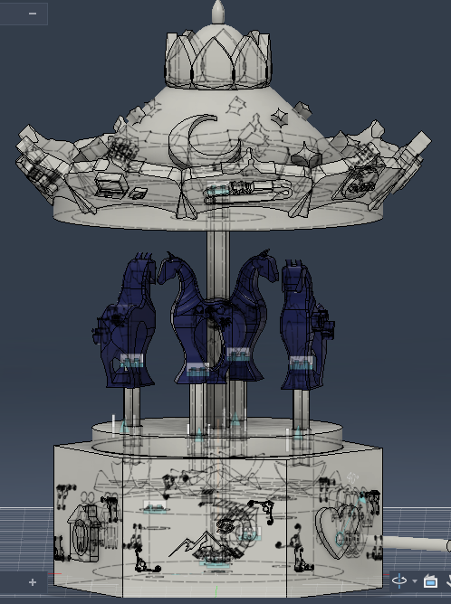 | 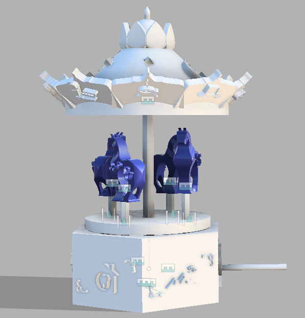 |


### Component Images

| Component | Image | Description |
|---|---|---|
| Base | 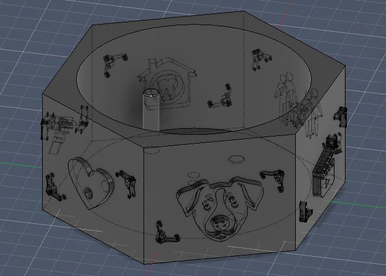 | Supports the carousel mechanism keeps the structure stable and provides the lower structure where the gears, cam disc, and rotating elements can be positioned. |
| Bevel gears | 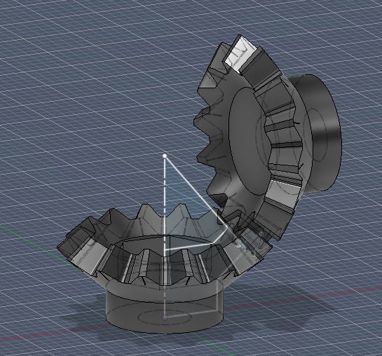 | Transfer the rotation from the horizontal crankshaft to the vertical main driver. |
| Main disc | 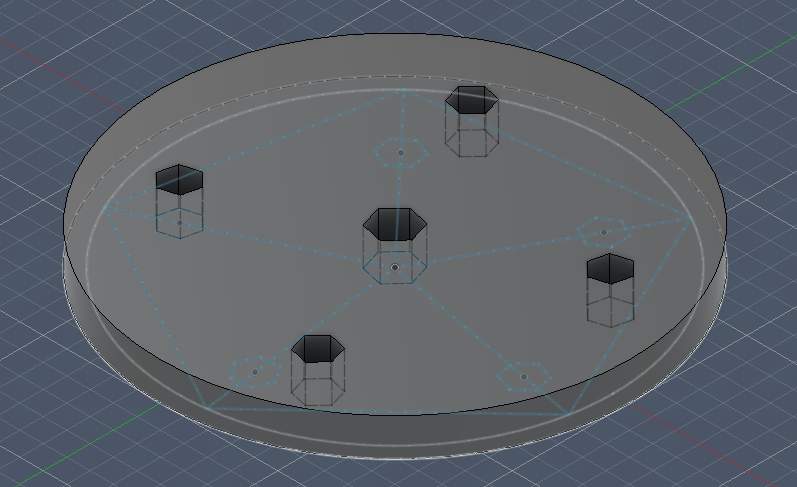 | Rotating platform that carries the horse supports. |
| Disc up-down / cam disc | 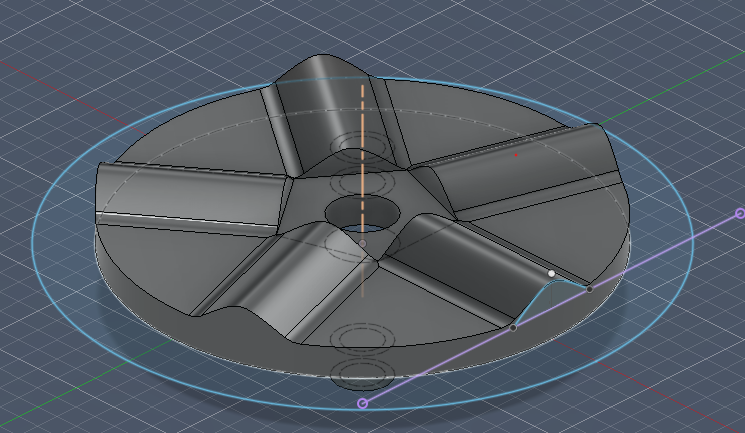 | Wavy cam disc that creates the vertical horse movement. |
| Horse support | 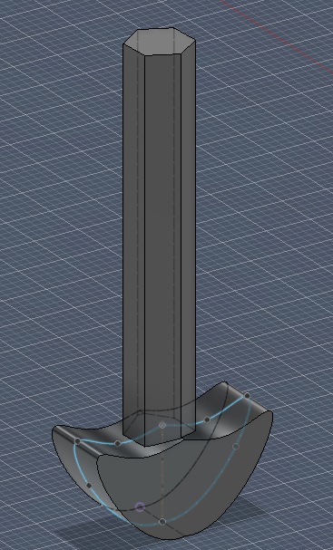 | Vertical support that follows the cam profile and moves the horse. |
| Carousel horse | 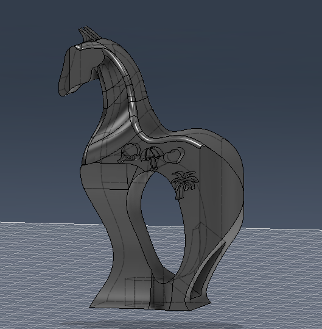 | Decorative horse mounted on the moving support. |
| Dome | 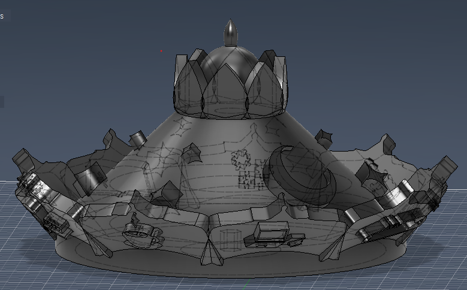 | Top decorative cover of the carousel. |
| Handler / crank | 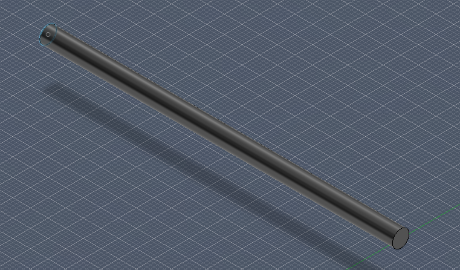 | Manual input component used to rotate the mechanism. |
| Main driver | 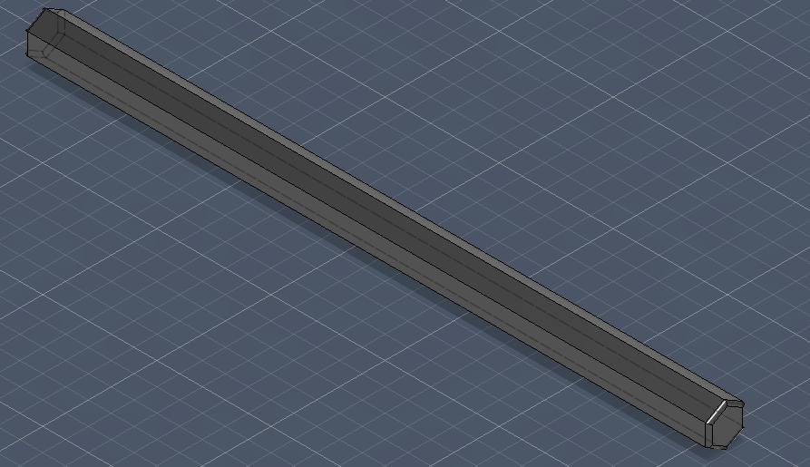 | Central axle that drives the rotating platform. |


## File Inventory & Directory Structure

The project is structured into functional component folders containing Autodesk Fusion 360 source models (`.f3d`), distributed assembly archives (`.f3z`), print-ready STL files (`.stl`), and sliced G-code files (`.gcode`).

### Project Tree

```text
3D-Carousel-Fusion-360-Project/
├── assembly/
│   ├── assembly.f3z         
│   └── lego.stl              
├── base/
│   ├── base.f3d              
│   ├── base.stl             
│   └── base_0.2mm_PETG...   
├── bevel_gears/
│   ├── bevel_gears.f3d       
│   ├── bevel_gears.stl      
│   └── bevel_gears_0.2mm...  
├── disc_up_down/
│   ├── disc_up_down.f3d      
│   ├── disc_up_down.stl     
│   └── disc_up_down_0.2mm... 
├── dome/
│   ├── dome.f3d              
│   ├── dome.stl              
│   └── dome_0.2mm_PETG...    
├── horses/
│   ├── horse_0.2mm_PETG...  
│   ├── horse_ALL_PLA_0.2mm...
│   ├── horse_AP.f3d / .stl   
│   ├── horse_AT.f3d / .stl   
│   ├── horse_DS.f3d / .stl   
│   └── horse_MT.f3d / .stl   
├── main_disc/
│   ├── maindisc.f3d          
│   ├── maindisc.stl          
│   └── maindisc_0.2mm_PETG...
├── pillars/
│   ├── External1_0.2mm...    
│   ├── handler.f3d / .stl    
│   ├── horse_support.f3d/.stl
│   └── main_driver.f3d / .stl
└── README.md
```
---
## 🛠️ Requirements & Tools Needed


### Software
*   **CAD Editor:** Autodesk Fusion 360 s)
*   **3D Slicing Software:** PrusaSlicer

### Hardware & Materials
*   **3D Printer:** FDM printer with a minimum build volume of $210 \times 210 \times 200 \text{ mm}$ (e.g., Prusa i3 MK3S/MK4, Bambu Lab P1P/A1).
*   **Filaments:**
    *   **PETG Filament:**
    *   **PLA Filament:** 

---

## Inspiration & References

This design was inspired by several mechanical concepts and existing projects:

- [Up and Down Motion Cam Mechanism (YouTube)](https://www.youtube.com/watch?v=5Y2WILQQ56A) – demonstrates face-cam mechanisms for vertical movement.
- [Manual Crank Mechanism Concept (YouTube)](https://youtu.be/N-yYhogDE1I?si=sfu1I9pkZn5Z7vtX) – showcases manual rotation systems.
- [General Carousel Motion Reference (YouTube)](https://www.youtube.com/watch?v=ssSaAyLIbHc&t=12s) – high-level conceptual flow.
- [Christmas Carousel Design Reference (Cults3D)](https://cults3d.com/en/3d-model/game/carrousel-de-noel-wildart3d) – artistic design inspiration.

---

